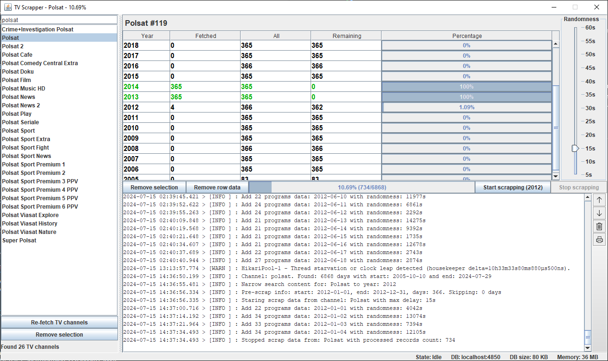
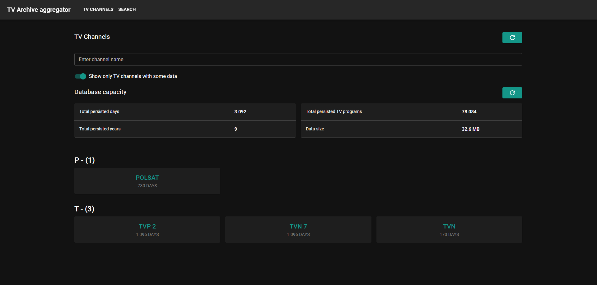
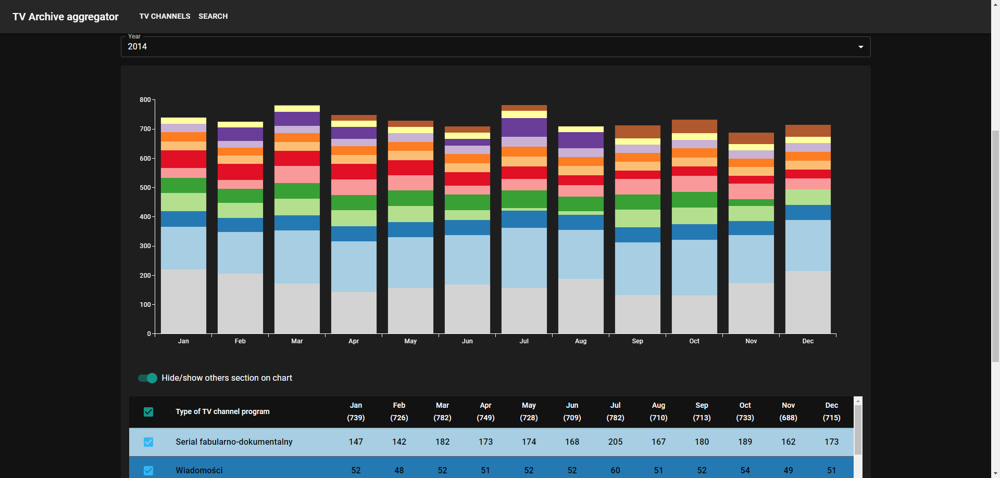
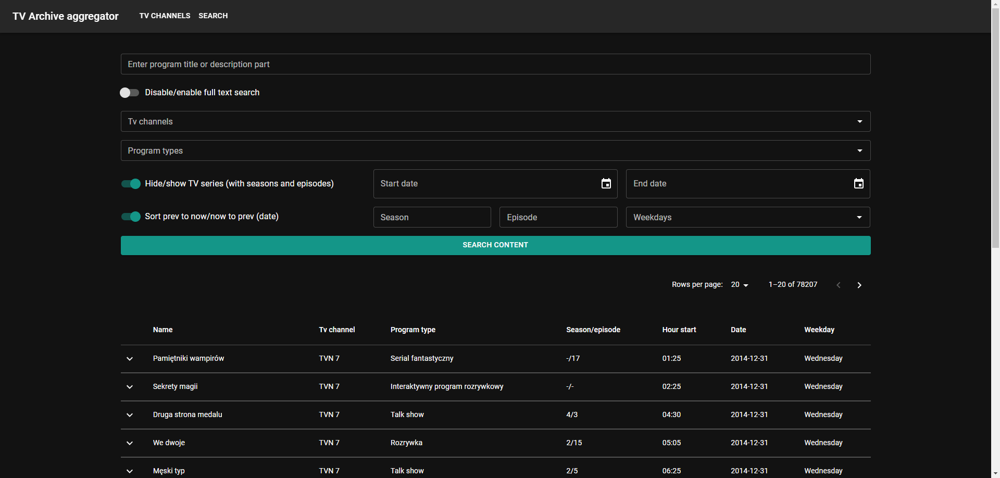

# TV archive aggregator

TV archive aggregator scrapping content from [telemagazyn.pl](https://telemagazyn.pl) and indexing it with more comfortable search system.

## Table of content
<!-- no toc -->
- [Features](#features)
- [Gallery](#gallery)
- [Prerequisites](#prerequisites)
- [Clone and install](#clone-and-install)
- [Prepare develop environment](#prepare-develop-environment)
- [Tech stack](#tech-stack)
- [Author](#author)
- [License](#license)

<a name="features"></a>
## Features
The main goal of this project is to improve the archiving system for TV programs and make them more easily searchable for interesting content from a given time period.

This project consists of 3 sub-projects:
- **web-scrapper** - scrapping data from website and saving in DB (desktop Java Swing app),
- **data-server** - Rest API written in Spring Boot,
- **web-ui** - Web client written in React and MUI component library.

Main features:
* make availability to scrap content from [telemagazyn.pl](https://telemagazyn.pl) and saving in defined structure in MySQL database,
* provide web API for preexisting web client or other clients (for example mobile),
* provide web UI for searching content by program type, TV channel or genre with advanced search system and additional data visualization tools.

<a name="gallery"></a>
## Gallery







<a name="prerequisites"></a>
## Prerequisites
* for develop environment:
	* Node v18 or higher (and corresponding NPM installation),
	* JDK 17 or higher,
  * Docker and Docker compose.
* for running environment:
	* JRE 17 or higher (only for desktop **web-scrapper** app),
	* Docker and Docker compose.

<a name="clone-and-install"></a>
## Clone and install
1. To install the program on your computer, use the command below:

```bash
$ git clone https://github.com/milosz08/tv-archive-aggregator
```

2. Create docker containers for **data-server**, **web-ui** and MySQL database via:

```bash
docker-compose up -d
```
This command should create 3 docker containers:
<table>
  <tr>
    <td>Application</td>
    <td>Port</td>
    <td>Description</td>
  </tr>
  <tr>
    <td>tv-scrapper-mysql-db</td>
    <td>4850</td>
    <td>MySQL database port</td>
  </tr>
  <tr>
    <td>tv-scrapper-data-server</td>
    <td>4851</td>
    <td>Rest API port</td>
  </tr>
  <tr>
    <td>tv-scrapper-web-ui</td>
    <td>4852</td>
    <td>Web client port</td>
  </tr>
</table>

3. Build and create executable JAR file of **web-scrapper** desktop app:
* for UNIX environment type:
```bash
./mvnw clean assembly:assembly
```

* for Windows environment type:
```powershell
.\mvnw.cmd clean assembly:assembly
```
This command create `tv-scrapper-1.0.0.jar` file in `.bin` directory. All application logs will be in `logs` directory. Optionally you can create `.env` file with database connection details (not required):

```properties
DB_HOST=localhost
DB_PORT=4850
DB_USERNAME=root
DB_PASSWORD=admin
DB_NAME=aggregator-db
```

<a name="prepare-develop-environment"></a>
## Prepare develop environment
1. Clone and install via `git clone` command (see *Clone and install* section).
2. Optionally, change MySQL root password in `.env` file:

```properties
TV_SCRAPPER_MYSQL_PASSWORD=admin
```

3. Go to root directory and run MySQL database via:
```bash
$ docker-compose up -d tv-scrapper-mysql-db
```
This command should initialize MySQL database with two tables: `tv_channels` and `tv_programs_data`.

4. Create `.env` files:
* for UNIX environment via `create-env.sh`:  

```bash
$ chmod +x create-env.sh
$ ./create-env.sh \
DB_HOST=localhost \
DB_PORT=4850 \
DB_USERNAME=root \
DB_PASSWORD=admin \
DB_NAME=aggregator-db
```
> NOTE: Optionally, add `-d` flag, if you can remove already existing `.env` file:

* for Windows environment via `create-env.ps1`:  

```powershell
.\create-env.ps1 -Arguments `
DB_HOST=localhost, `
DB_PORT=4850, `
DB_USERNAME=root, `
DB_PASSWORD=admin, `
DB_NAME=aggregator-db
```
> NOTE: Optionally, add `-Overwrite` flag, if you can remove already existing `.env` file:

5. That's it. Now you can run **data-server**, **web-scrapper** and **web-ui** in your favorite IDE (prefers Intellij IDEA for first two and Visual Studio Code for **web-ui**).

<a name="tech-stack"></a>
## Tech stack
* Java SE 17
* Swing UI
* Spring Boot 3
* MySQL with JDBC Spring data
* React with Tanstack Query
* MUI components library

## Author
Created by Miłosz Gilga. If you have any questions about this application, send message: [personal@miloszgilga.pl](mailto:personal@miloszgilga.pl).

## License

This software is on Apache 2.0 License.